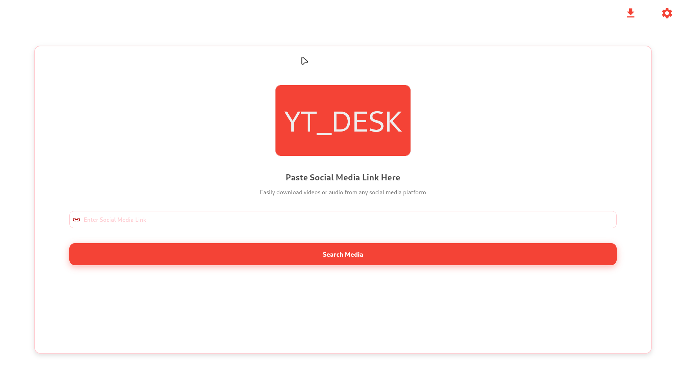
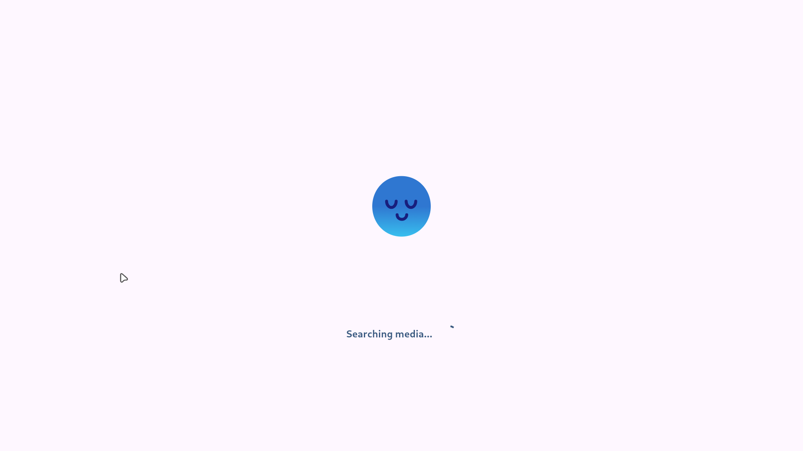
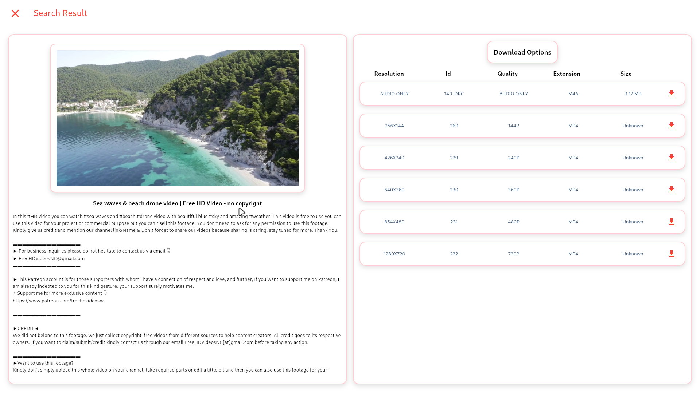
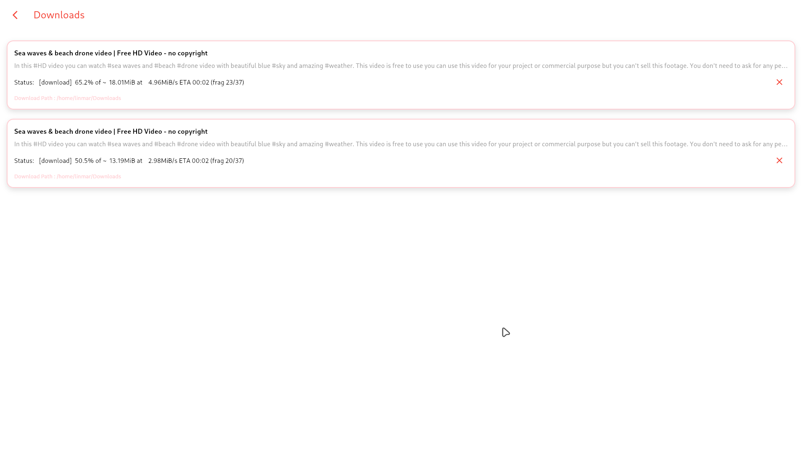

# YT_DESK

YT_DESK is a Flutter application designed for downloading videos and audio from various social media platforms. The app provides an easy-to-use GUI and ensures that all necessary dependencies, such as Python and yt-dlp, are installed automatically.

## Features

- **Simple GUI**: User-friendly interface for downloading videos and audio from social media platforms.
- **Automatic Dependency Management**: Checks for Python installation and installs it if missing.
- **yt-dlp Management**: Automatically checks for the yt-dlp package after Python installation and installs it if required.
- **Password Prompt Handling**: Seamless handling of sudo password prompts during installation.

## Installation

### 1. Clone the Repository
```bash
    git clone https://github.com/adityakumar-dev/YT_DESK
```

### Navigate to the project directory
```bash
    cd YT_DESK
```
### install packages
```bash
    flutter pub get
```
### run project
```bash 
    flutter run
```

## Screenshots

### HOME



### SEARCHING MEDIA 




### SEARCH RESULT 



### DOWNLOAD MANAGER 




## Thanks for Visting
